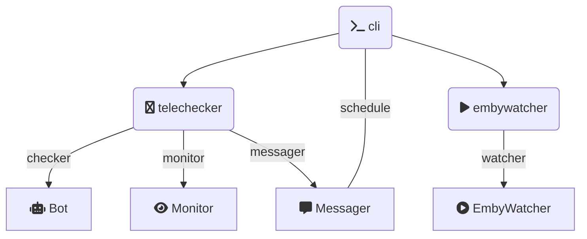

[](https://pypi.org/project/embykeeper/) [](https://pypi.org/project/embykeeper/) [](https://pypi.org/project/embykeeper/) [](https://github.com/embykeeper/embykeeper/blob/main/LICENSE) [](https://t.me/embykeeper_bot) [](https://t.me/embykeeper)

<p align="center">
  <a href='https://github.com/embykeeper/embykeeper'>
    
  </a>
</p>
<p align="center">
    <b>自动签到 定时保号 按需水群</b>
</p>

---

Embykeeper 是一个在中文社群规则下用于 Emby 影视服务器的签到和保号的自动执行工具, 基于 Pyrogram 编写并具有可拓展性.

## 声明

本项目涉及的一切 Emby 服务器与 Embykeeper 开发团队无关, 在使用 Embykeeper 时造成的一切损失 (包括但不限于 Emby 或 Telegram 账号被封禁或被群封禁) 与开发团队无关. 

本项目设计初衷是在中文 Emby 社群规则下, 保号要求逐渐苛刻 (部分要求每月登录或每日签到), 这使得休闲时间紧张的人士难以安心使用. 本项目仅旨在帮助该类人群保号, 不鼓励持有大量 Emby 账号而不使用, 导致真正需要的人、为中文影视资源分享和翻译有贡献的人难以获得账号的行为, 开发团队也呼吁仅保留 1-2 个较全面质量较高的 Emby 服务器. 本项目仅提供工具, 具体使用形式及造成的影响和后果与开发团队无关. 

本项目欢迎友善讨论与建议, 您可以通过 [Github Issue](https://github.com/embykeeper/embykeeper) 途径反馈, 并认可开发团队可以关闭与项目开发不直接相关的不友善讨论. 您也可以通过 [Telegram 讨论组](https://t.me/embykeeper_chat) 与开发团队进行交流.

当您使用 "消息提示" 功能, 该工具时候将自动向 "[Embykeeper Auth Bot](https://t.me/embykeeper_auth_bot)" 发送关键的成功/失败日志以供从 "[Embykeeper Bot](https://t.me/embykeeper_bot)" 向您推送, 日志内容不含任何密码或密钥信息, 您认可该命令不会给您带来隐私与安全问题. 

当您安装并使用该工具, 默认您已经阅读并同意上述声明, 并确认自己并非出于"集邮"目的而安装. 

## 功能

- Telegram 机器人签到
  - 支持群组
    - 终点站: [频道](https://t.me/embypub) [群组](https://t.me/EmbyPublic) [机器人](https://t.me/EmbyPublicBot)
    - 卷毛鼠: [频道]() [群组](https://t.me/Curly_Mouse) [机器人](https://t.me/jmsembybot)
    - Nebula: [频道](https://t.me/Nebula_Emby) [群组](https://t.me/NebulaEmbyUser) [机器人](https://t.me/Nebula_Account_bot) (由于需要付费跳过 Cloudflare 验证码, 需要[高级用户](https://t.me/embykeeper_bot?start=__prime))
    - BlueSea: [群组](https://t.me/blueseachat) [机器人](https://t.me/blueseamusic_bot)
    - Singularity: [频道](https://t.me/Singularity_Emby_Channel) [群组](https://t.me/Singularity_Emby_Group) [机器人](https://t.me/Singularity_Emby_Bot)
    - Peach: [频道](https://t.me/peach_emby_channel) [群组](https://t.me/peach_emby_chat) [机器人](https://t.me/peach_emby_bot)
    - EmbyHub: [频道](https://t.me/embyhub) [群组](https://t.me/emby_hub) [机器人](https://t.me/EdHubot)
    - Pornemby (_测试中_): [频道](https://t.me/pornembyservice) [机器人](https://t.me/PronembyTGBot2_bot)
    - 其他非 Emby 相关:
      - 搜书神器 ([@chneez](https://github.com/embykeeper/embykeeper/pull/8) 增加) (_测试中_)
    - 默认禁用:
      - Pornemby 科举考试 (_测试中_): [活动频道](https://t.me/PornembyFun)
      - ~~卷毛鼠 IPTV: [频道](https://t.me/CurlyMouseIPTV) [群组](https://t.me/Curly_MouseIPTV) [机器人](https://t.me/JMSIPTV_bot)~~ (无响应)
      - ~~垃圾影音: [群组](https://t.me/+3sP2A-fgeXg0ZmY1) [机器人](https://t.me/zckllflbot)~~ (无响应)
  - 特性
    - 验证码识别与自动重试
    - 多账户签到
    - 网页类型签到
- Emby 保活
  - 定时模拟账号登录视频播放
  - 播放时间与进度模拟
- Telegram 自动水群 (默认使用内建话术列表, 易被辨别和封禁, 请谨慎使用)
  - NakoNako 自动水群: [群组](https://t.me/NakoNetwork) [机器人](https://t.me/nakonetwork_bot)
- Telegram 自动监控信息 (需要[超级用户](https://t.me/embykeeper_bot?start=__prime))
  - 不给看 抢邀请码: [群组](https://t.me/Ephemeralemby) [机器人](https://t.me/UnknownEmbyBot)
  - Embyhub 开注自动注册: [频道](https://t.me/embyhub) [群组](https://t.me/emby_hub) [机器人](https://t.me/EdHubot)

## 安装与使用

### 从 Docker 安装

Embykeeper 可以通过 `docker` 运行, 您需[安装 docker](https://yeasy.gitbook.io/docker_practice/install), 然后执行:

```bash
touch config.toml
docker run -v $(pwd)/config.toml:/app/config.toml --rm -it embykeeper/embykeeper
```

命令将会在当前目录生成模板 `config.toml` 文件, 您也可以使用最小配置 (以下敏感信息为生成, 仅做参考):

```toml
[proxy]
hostname = "127.0.0.1"
port = "1080"
scheme = "socks5"

[[telegram]]
api_id = "27894236"
api_hash = "622159182fdd4b15b627eeb3ac695271"
phone = "+8612109347899"

[[emby]]
url = "https://weiss-griffin.com/"
username = "carrie19"
password = "s*D7MMCpS$"
```

对于 Telegram 而言, 您可以通过 [Telegram 官网](https://my.telegram.org/) 申请 `api_id` 和 `api_hash`. 登陆后选择 `API development tools`, 随后应用信息可以随意填写, 请注意 `URL` 是必填项, 可以填写 `localhost`. 提交时若显示 "Error", 您可能需要更换应用名称/短名称/代理/清除浏览器记录并重试.

随后, 您需要再次执行:

```bash
docker run -v $(pwd)/config.toml:/app/config.toml --rm -it embykeeper/embykeeper
```

您将被询问设备验证码以登录, 登录成功后, Embykeeper 将首先执行一次签到和保活, 然后启动群组监控和水群计划任务 (若启用).

恭喜您！您已经成功部署了 Embykeeper, 为了让 Embykeeper 长期后台运行, 您可以通过`Ctrl+C`停止, 然后运行:

```bash
docker run -d -v $(pwd)/config.toml:/app/config.toml embykeeper/embykeeper
```

或者使用 [docker-compose](https://docs.docker.com/compose/) ([watchtower](https://github.com/containrrr/watchtower) 被用于自动更新容器服务):

```yaml
version: '3'
services:
  embykeeper:
    container_name: embykeeper
    image: cembykeeper/embykeeper
    restart: unless-stopped
    volumes:
      - ./config.toml:/app/config.toml
  watchtower:
    container_name: watchtower
    image: containrrr/watchtower
    restart: unless-stopped
    volumes:
      - /var/run/docker.sock:/var/run/docker.sock:rw
```

即可在后台启动 embykeeper.

您可以通过 `docker logs -f embykeeper` 或 `docker-compose logs -f embykeeper` 以查看最新日志.

如果您需要使用主机上的代理服务器 (例如 `https://localhost:1080`), 您可能需要使用 `--net=host` 参数以使用主机网络模式.

### 从 Pypi 安装

Embykeeper 需要 Python 环境以运行, 您可以通过 [conda](https://github.com/conda/conda) 或 [virtualvenv](https://virtualenv.pypa.io/) 等工具进行环境的管理.

您可以通过 `pip` 安装 `embykeeper` (需要 `python >= 3.7, < 3.11`):

```bash
pip install embykeeper
```

随后, 您需要执行:

```bash
embykeeper
```

命令将会在当前目录生成模板 `config.toml` 文件, 您需要修改您的账号配置 (详见[从 Docker 安装](https://github.com/embykeeper/embykeeper#%E4%BB%8E%20Docker%20%E5%AE%89%E8%A3%85)).

随后, 您需要再次执行:

```bash
embykeeper
```

您将被询问设备验证码以登录, 登录成功后, Embykeeper 将首先执行一次签到和保活, 然后启动群组监控和水群计划任务 (若启用).

恭喜您！您已经成功部署了 Embykeeper, 为了让 Embykeeper 长期后台运行, 您可以通过`Ctrl+C`停止, 然后运行:

```bash
tmux
```

这将启动一个 `tmux` 终端, 您可以在该终端中运行上述命令 (`embykeeper config.toml`), 并按 Ctrl + B, 松开 B 再按 D, 以脱离 `tmux` 终端. 

您随时可以通过运行:

```bash
tmux a
```

以重新连接到 `tmux` 终端.

当版本更新时, 您需要执行:

```
pip install -U embykeeper
```

然后重新运行应用.

### 从源码构建

首先拉取 Github 并安装:

```bash
git clone https://github.com/embykeeper/embykeeper.git
cd embykeeper
make develop
```

然后即可执行 Embykeeper:

```bash
embykeeper
```

详细配置方法详见 [从 Pypi 安装](https://github.com/embykeeper/embykeeper#%E4%BB%8E%20Pypi%20%E5%AE%89%E8%A3%85).

当版本更新时, 您需要执行:

```
git pull
```

然后重新运行应用.

## 命令行帮助

您可以通过运行 `embykeeper -h` 以获取帮助:

```bash
$ embykeeper -h

欢迎使用 Embykeeper. 🎦 无参数默认开启全部功能.

参数:
    config  配置文件 (置空以生成)
模块开关:
    --checkin     -c   启用每日指定时间签到 (不指定值时默认为6:00PM)
    --emby        -e   启用每隔天数Emby自动保活 (不指定值时默认为每7天)
    --monitor     -m   启用群聊监视
    --send        -s   启用自动水群
调试参数:
    --no-instant  -I   不立刻执行一次计划任务
    --debug       -d   开启调试模式, 错误将会导致程序停止运行
    --version     -v   打印 Embykeeper 版本
    --follow      -f   仅启动消息调试
    --analyze     -a   仅启动历史信息分析
```

例如:

```bash
# 仅启动每日签到
$ embykeeper config.toml -c

# 仅启动每日 8:00 PM 签到
$ embykeeper config.toml -c 8:00PM

# 启动所有功能, 同时调整签到时间为 8:00 AM, 调整保活间隔天数为 14
$ embykeeper config.toml -c 8:00PM -e 14 -m -s
```

您也可以使用附带的调试工具帮助本项目的开发, 例如历史记录分析器:

```bash
# 启动历史信息分析
$ embykeeper config.toml -a

请输入群组用户名 (以空格分隔): https://t.me/XXX YYY 10253512
请输入关键词 (以空格分隔):
输入时间范围 (以"-"分割): 8:00AM-10:00AM
请输入各群组最大获取数量 [1000]:
```

该命令会分析特定群组的历史记录, 以帮助您撰写自动水群工具的话术列表.

另一个工具是即时信息分析:


该工具可以实时输出消息的 ID 等信息, 以方便调试.

## 消息推送与高级用户

您可以通过设置项 "`notifier`" 设置 成功/失败 通知将被发送的 Telegram 账号, 您可以通过 [Embykeeper Bot](https://t.me/embykeeper_bot) 设置消息每日发送的时间.

本项目涉及的需要 Cloudflare 验证码付费跳过的操作 (例如 Nebula 签到)、可能会引起竞争的操作 (例如自动抢邀请码)将需要高级用户, 您可以通过 [Embykeeper Bot](https://t.me/embykeeper_bot?start=__prime) 成为高级用户.

目前有三种方式成为高级用户:

1. 分享 1 个邀请制 Emby 的邀请码;
2. 为本项目提供 [Pull Requests](https://github.com/embykeeper/embykeeper/pulls) 并被合并;
3. 通过爱发电赞助一个[小包子](https://afdian.net/a/jackzzs);

## 支持 Embykeeper

##### 开发者团队

- [jackzzs](https://github.com/jackzzs)

##### 通过[爱发电](https://afdian.net/a/jackzzs)赞助


## 配置项

| 设置项       | 值类型             | 简介                                         | 默认值  |
| ------------ | ------------------ | -------------------------------------------- | ------- |
| `timeout`    | `int`              | Telegram 机器人签到超时 (秒)                 | `120`   |
| `retries`    | `int`              | Telegram 机器人签到错误重试次数              | `10`    |
| `concurrent` | `int`              | Telegram 机器人签到最大并发                  | `1`     |
| `random`     | `int`              | Telegram 机器人签到定时任务时间随机量 (分钟) | `15`    |
| `notifier`   | `int`/`bool`/`str` | 发送通知到 Telegram 账号 (序号/手机号)       | `False` |
| `service`    | `dict`             | 签到/水群/监视功能开启站点设置               | `{}`    |
| `proxy`      | `dict`             | 代理设置                                     | `{}`    |
| `telegram`   | `list`             | Telegram 账号设置 (支持多账号)               | `[]`    |
| `emby`       | `list`             | Emby 账号设置 (支持多账号)                   | `[]`    |

`service`设置可以为:

| 设置项      | 值类型 | 简介           | 默认值               |
| ----------- | ------ | -------------- | -------------------- |
| `checkiner` | `list` | 启用的签到站点 | (当前所有支持的站点) |
| `monitor`   | `list` | 启用的监视会话 | (当前所有支持的会话) |
| `messager`  | `list` | 启用的水群会话 | (当前所有支持的会话) |

注意, 当您未曾与站点机器人对话, 该站点签到将不会运行.
若您需要禁用部分签到站点, 您可以在列表中删除对应的名称.
若您需要使用默认禁用的签到站点, 您可以在列表中增加对应的名称.
当前支持的名称包括:
| 站点 | 名称 | | 站点 | 名称 |
| --- | --- | --- |--- | --- |
| 垃圾影音 | `ljyy` | | 搜书神器 | `sosdbot` |
| 卷毛鼠 IPTV | `jms_iptv` | | 终点站 | `terminus` |
| Pornemby | `pornemby` | | Singularity | `singularity` |
| Peach | `peach` | | Nebula | `nebula` |
| Bluesea | `bluesea` | | Embyhub | `embyhub` |
| 卷毛鼠 | `jms` | | | |

`proxy` 设置可以为:

| 设置项     | 值类型 | 简介                                    | 默认值      |
| ---------- | ------ | --------------------------------------- | ----------- |
| `hostname` | `str`  | 代理服务器地址                          | `localhost` |
| `port`     | `int`  | 代理端口号                              | `1080`      |
| `scheme`   | `str`  | 代理协议, 可以为 "`socks5`" 或 "`http`" | `socks5`    |

`telegram` 设置可以为:

| 设置项     | 值类型 | 简介                                                               | 默认值  |
| ---------- | ------ | ------------------------------------------------------------------ | ------- |
| `api_id`   | `str`  | 从[Telegram 官网](https://my.telegram.org/)申请的 Application ID   |         |
| `api_hash` | `str`  | 从[Telegram 官网](https://my.telegram.org/)申请的 Application Hash |         |
| `phone`    | `str`  | 账户手机号, 一般为 "`+86...`"                                      |         |
| `monitor`  | `bool` | 启用群组监控系列功能                                               | `false` |
| `send`     | `bool` | 启用自动水群系列功能                                               | `false` |

`emby` 设置可以为:

| 设置项     | 值类型 | 简介                                                      | 默认值 |
| ---------- | ------ | --------------------------------------------------------- | ------ |
| `url`      | `str`  | Emby 服务器地址, 一般为 "`https://...`" 或 "`http://...`" |        |
| `username` | `str`  | Emby 服务器用户名                                         |        |
| `password` | `str`  | Emby 服务器密码                                           |        |
| `time`     | `int`  | 模拟观看的时间 (秒)                                       | `800`  |
| `progress` | `int`  | 观看后模拟进度条保存的时间 (秒)                           | `1000` |

## 代码重用与开发

代码架构如下:



主要可以扩展的类位于:

- `embykeeper.telechecker.bots`
- `embykeeper.telechecker.monitor`
- `embykeeper.telechecker.messager`

通常来说, 增加一个机器人的签到非常简单, 您需要在 `bots` 中增加一个文件 `dummy.py`:

```python
from .base import BotCheckin

class DummyCheckin(BotCheckin):
    name = "Dummy"
    bot_username = "dummy"
    bot_captcha_len = 4
```

您即增加一个名为 "`Dummy`" 的签到器, 将会向用户名为 "`dummy`" 的机器人发送 "`/checkin`" 并等候一个 4 位的验证码, 识别验证码后将发送.

若您希望识别验证码后点击按钮, 您可以使用 `AnswerBotCheckin`, 您也可以重写 `on_captcha` 函数来实现自定义功能:

```python
from .base import AnswerBotCheckin

class DummyCheckin(AnswerBotCheckin):
    ....
    async def on_captcha(self, message: Message, captcha: str):
        for l in captcha:
            try:
                await self.message.click(l)
            except ValueError:
                self.log.info(f'未能找到对应 "{l}" 的按键, 正在重试.')
                await self.retry()
                break
```

上述代码实现每次按对应一个字符按键的功能.

当您实现一个新的签到器时, 欢迎您提出 [Pull Requests](https://github.com/embykeeper/embykeeper/pulls) 以帮助更多人使用!
