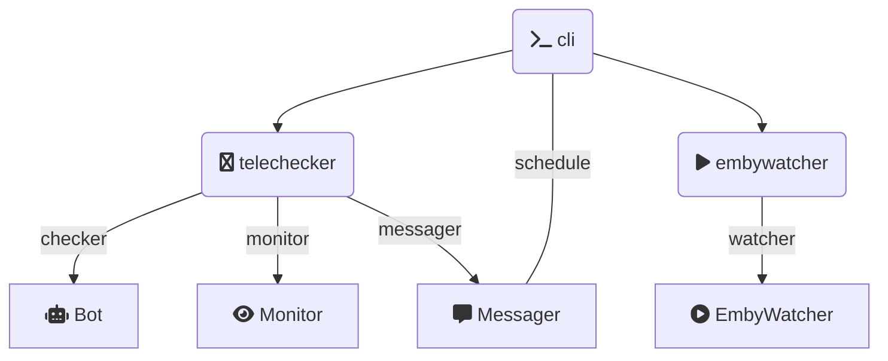

<p align="center">
    
</p>
<p align="center">
    <b>自动签到 定时保号 按需水群</b>
</p>

---

Embykeeper 是一个在中文社群规则下用于 Emby 影视服务器的签到和保号的工具, 基于Pyrogram编写并具有可拓展性。

## 声明

本项目涉及的一切 Emby 服务器与 Embykeeper 开发团队无关，在使用 Embykeeper 时造成的一切损失（包括但不限于 Emby 或 Telegram 账号被封禁或被群封禁）与开发团队无关。

本项目设计初衷是在中文 Emby 社群规则下，保号要求逐渐苛刻（部分要求每月登录或每日签到），这使得休闲时间紧张的人士难以安心使用。本项目仅旨在帮助该类人群保号，不鼓励持有大量 Emby 账号而不使用，导致真正需要的人、为中文影视资源分享和翻译有贡献的人难以获得账号的行为，开发团队也呼吁仅保留1-2个较全面质量较高的Emby服务器。本项目仅提供工具，具体使用形式及造成的影响和后果与开发团队无关。

当您安装并使用该工具，默认您已经阅读并同意上述声明，并确认自己并非出于"集邮"目的而安装。

## 功能

* Telegram 机器人签到

  * 支持群组
    * 终点站: [频道](https://t.me/embypub) [群组](https://t.me/EmbyPublic) [机器人](https://t.me/EmbyPublicBot)
    * 卷毛鼠: [频道]() [群组](https://t.me/Curly_Mouse) [机器人](https://t.me/jmsembybot)
    * 卷毛鼠 IPTV: [频道](https://t.me/CurlyMouseIPTV) [群组](https://t.me/Curly_MouseIPTV) [机器人](https://t.me/JMSIPTV_bot)
    * Nebula: [频道](https://t.me/Nebula_Emby) [群组](https://t.me/NebulaEmbyUser) [机器人](https://t.me/Nebula_Account_bot)
    * Peach: [频道](https://t.me/peach_emby_channel) [群组](https://t.me/peach_emby_chat) [机器人](https://t.me/peach_emby_bot)
    * 垃圾影音: [群组](https://t.me/+3sP2A-fgeXg0ZmY1) [机器人](https://t.me/zckllflbot)
    * BlueSea: [群组](https://t.me/blueseachat) [机器人](https://t.me/blueseamusic_bot)
    * EmbyHub: [频道](https://t.me/embyhub) [群组](https://t.me/emby_hub) [机器人](https://t.me/EdHubot)
    * Singularity: [频道](https://t.me/Singularity_Emby_Channel) [群组](https://t.me/Singularity_Emby_Group) [机器人](https://t.me/Singularity_Emby_Bot)
  * 高级特性
    * 验证码识别与自动重试
    * 多账户签到
    * 网页类型签到
* Emby 保活

  * 定时模拟账号登录视频播放
  * 播放时间与进度模拟
* Telegram 自动监控信息
* * 不给看 抢邀请码
  * Embyhub 开注自动注册
* Telegram 自动水群

  * NakoNako 自动水群

## 安装与使用

您可以通过 `pip` 安装 `embykeeper` (需要 `python >= 3.6`):

```bash
pip install embykeeper
```

随后，您需要执行:

```bash
embykeeper
```

命令将会在当前目录生成模板 `config.toml` 文件，您也可以使用最小配置 (以下敏感信息为生成, 仅做参考):

```toml
[proxy]
hostname = "127.0.0.1"
port = "1080"
scheme = "socks5"

[[telegram]]
api_id = "27894236"
api_hash = "622159182fdd4b15b627eeb3ac695271"
phone = "+8612109347899"

[[emby]]
url = "https://weiss-griffin.com/"
username = "carrie19"
password = "s*D7MMCpS$"
```

对于 Telegram 而言, 您可以通过 [Telegram 官网](https://my.telegram.org/) 申请 `api_id` 和 `api_hash`. 登陆后选择 API development tools, 随后应用信息可以随意填写, 提交时若显示 "Error", 您可能需要更换代理/清除浏览器记录.

然后, 运行:

```bash
embykeeper config.toml
```

您将被询问设备验证码以登录，登录成功后，Embykeeper 将首先执行一次签到和保活, 然后启动群组监控和水群计划任务 (若启用).

恭喜您！您已经成功部署了 Embykeeper, 为了让 Embykeeper 长期后台运行, 您可以运行:

```bash
tmux
```

这将启动一个 `tmux` 终端，您可以在该终端中运行上述命令 (`embykeeper config.toml`), 并按 Ctrl + B, 松开 B 再按 D, 以脱离 `tmux` 终端。

您随时可以通过运行:

```bash
tmux a
```

以重新连接到 `tmux` 终端.

## 支持 Embykeeper

##### 贡献者名单
 * 暂无

##### 活跃开发者名单
 * [jackzzs] (https://github.com/jackzzs)

##### 通过[爱发电](https://afdian.net/a/jackzzs)赞助


## 配置项

| 设置项         | 值类型   | 简介                                        | 默认值 |
| -------------- | -------- | ------------------------------------------- | ------ |
| `timeout`    | `int`  | Telegram机器人签到超时 (秒)                 | `60` |
| `retries`    | `int`  | Telegram机器人签到错误重试次数              | `10` |
| `concurrent` | `int`  | Telegram机器人签到最大并发                  | `2`  |
| `random`     | `int`  | Telegram机器人签到定时任务时间随机量 (分钟) | `15` |
| `proxy`      | `dict` | 代理设置                                    | `{}` |
| `telegram`   | `list` | Telegram账号设置 (支持多账号)               | `[]` |
| `emby`       | `list` | Emby账号设置 (支持多账号)                   | `[]` |

`proxy` 设置可以为:

| 设置项     | 值类型  | 简介                                | 默认值        |
| ---------- | ------- | ----------------------------------- | ------------- |
| `hostname`   | `str` | 代理服务器地址                      | `localhost` |
| `port`   | `int` | 代理端口号                          | `1080`      |
| `scheme` | `str` | 代理协议, 可以为 "socks5" 或 "http" | `socks5`    |

`telegram` 设置可以为:

| 设置项       | 值类型   | 简介                                                           | 默认值    |
| ------------ | -------- | -------------------------------------------------------------- | --------- |
| `api_id`   | `str`  | 从[Telegram官网](https://my.telegram.org/)申请的 Application ID   |           |
| `api_hash` | `str`  | 从[Telegram官网](https://my.telegram.org/)申请的 Application Hash |           |
| `phone`    | `str`  | 账户手机号, 一般为 "+86..."                                    |           |
| `monitor`  | `bool` | 启用群组监控系列功能                                           | `true`  |
| `send`     | `bool` | 启用自动水群系列功能                                           | `false` |

`emby` 设置可以为:

| 设置项       | 值类型  | 简介                                                 | 默认值   |
| ------------ | ------- | ---------------------------------------------------- | -------- |
| `url`      | `str` | Emby服务器地址, 一般为 "https://..." 或 "http://..." |          |
| `username` | `str` | Emby服务器用户名                                     |          |
| `password` | `str` | Emby服务器密码                                       |          |
| `time`     | `int` | 模拟观看的时间 (秒)                                  | `800`  |
| `progress` | `int` | 观看后模拟进度条保存的时间 (秒)                      | `1000` |

## 代码重用与开发

代码架构如下:



主要可以扩展的类位于:

* `embykeeper.telechecker.bots`
* `embykeeper.telechecker.monitor`
* `embykeeper.telechecker.messager`

通常来说, 增加一个机器人的签到非常简单, 您需要在 `bots` 中增加一个文件 `dummy.py`:

```python
from .base import BotCheckin

class DummyCheckin(BotCheckin):
    name = "Dummy"
    bot_username = "dummy"
    bot_captcha_len = 4
```

然后在 `embykeeper/telechecker/__init__.py` 中注册您的类:

```python
from .bots.dummy import DummyCheckin
```

然后在 `embykeeper/telechecker/main.py` 中启用您的类:

```python
CHECKINERS = [
    ...
    DummyCheckin,
]
```

您即增加一个名为 "`Dummy`" 的签到器，将会向用户名为 "`dummy`" 的机器人发送 "`/checkin`" 并等候一个4位的验证码，识别验证码后将发送.

若您希望识别验证码后点击按钮, 您可以使用 `AnswerBotCheckin`, 您也可以重写 `on_captcha` 函数来实现自定义功能:

```python
from .base import AnswerBotCheckin

class DummyCheckin(AnswerBotCheckin):
    ....
    async def on_captcha(self, message: Message, captcha: str):
        for l in captcha:
            try:
                await self.message.click(l)
            except ValueError:
                self.log.info(f'未能找到对应 "{l}" 的按键, 正在重试.')
                await self.retry()
                break
```

上述代码实现每次按对应一个字符按键的功能.

当您实现一个新的签到器时, 欢迎您提出 Pull Request 以帮助更多人使用!
