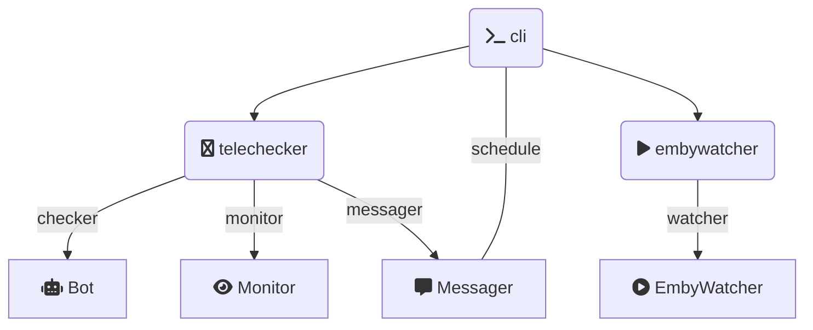

[](https://github.com/embykeeper/embykeeper/commits/main) [](https://pypi.org/project/embykeeper/) [](https://pypi.org/project/embykeeper/) [](https://hub.docker.com/r/embykeeper/embykeeper) [](https://github.com/embykeeper/embykeeper/blob/main/LICENSE) [](https://t.me/embykeeper_bot) [](https://t.me/embykeeper)

<p align="center">
  <a href='https://github.com/embykeeper/embykeeper'>
    
  </a>
</p>
<p align="center">
    <b>自动签到 定时保号 按需水群</b>
</p>

---

Embykeeper 是一个在中文社群规则下用于 Emby 影视服务器的签到和保号的自动执行工具, 基于 Pyrogram 编写并具有可拓展性.

## 声明

本项目涉及的一切 Emby 服务器与 Embykeeper 开发团队无关, 在使用 Embykeeper 时造成的一切损失 (包括但不限于 Emby 或 Telegram 账号被封禁或被群封禁) 与开发团队无关.

本项目设计初衷是在中文 Emby 社群规则下, 保号要求逐渐苛刻 (部分要求每月登录或每日签到), 这使得休闲时间紧张的人士难以安心使用. 本项目仅旨在帮助该类人群保号, 不鼓励持有大量 Emby 账号而不使用, 导致真正需要的人、为中文影视资源分享和翻译有贡献的人难以获得账号的行为, 开发团队也呼吁仅保留 1-2 个较全面质量较高的 Emby 服务器. 本项目仅提供工具, 具体使用形式及造成的影响和后果与开发团队无关.

本项目欢迎友善讨论与建议, 您可以通过 [Github Issue](https://github.com/embykeeper/embykeeper) 途径反馈, 并认可开发团队可以关闭与项目开发不直接相关的不友善讨论. 您也可以通过 [Discord](https://discord.gg/QCVhBT5y) 获得社区帮助.

当您使用 "消息提示" 功能, 该工具时候将自动向 "[Embykeeper Auth Bot](https://t.me/embykeeper_auth_bot)" 发送关键的成功/失败日志以供从 "[Embykeeper Bot](https://t.me/embykeeper_bot)" 向您推送, 日志内容不含任何密码或密钥信息, 您认可该命令不会给您带来隐私与安全问题.

当您安装并使用该工具, 默认您已经阅读并同意上述声明, 并确认自己并非出于"集邮"目的而安装.

## 功能

- Telegram 机器人签到

  - 卷毛鼠: [频道](https://t.me/CurlyMouse) [群组](https://t.me/Curly_Mouse) [机器人](https://t.me/jmsembybot)
  - 终点站: [频道](https://t.me/embypub) [群组](https://t.me/EmbyPublic) [机器人](https://t.me/EmbyPublicBot)
  - Singularity: [频道](https://t.me/Singularity_Emby_Channel) [群组](https://t.me/Singularity_Emby_Group) [机器人](https://t.me/Singularity_Emby_Bot)
  - Peach: [频道](https://t.me/peach_emby_channel) [群组](https://t.me/peach_emby_chat) [机器人](https://t.me/peach_emby_bot)
  - Pornemby: [频道](https://t.me/pornembyservice) [群组](https://t.me/Pornemby) [机器人](https://t.me/PronembyTGBot2_bot)
  - 垃圾影音: [群组](https://t.me/+3sP2A-fgeXg0ZmY1) [机器人](https://t.me/zckllflbot)
  - 卡戎: [频道](https://t.me/CharonTV) [群组](https://t.me/CharonTV_Talk) [机器人](https://t.me/CharonTV_Bot)
  - Misty: [频道](https://t.me/FreeEmbyChannel) [群组](https://t.me/FreeEmby) [机器人](https://t.me/EmbyMistyBot)
  - EmbyHub: [频道](https://t.me/embyhub) [群组](https://t.me/emby_hub) [机器人](https://t.me/EdHubot)~~
  - 其他非 Emby 相关:
    - 搜书神器 ([@chneez](https://github.com/embykeeper/embykeeper/pull/8) 增加): [机器人](https://t.me/sosdbot)
  - 默认禁用:
    - ~~BlueSea: [群组](https://t.me/blueseachat) [机器人](https://t.me/blueseamusic_bot)~~ (关服)
    - ~~卷毛鼠 IPTV: [频道](https://t.me/CurlyMouseIPTV) [群组](https://t.me/Curly_MouseIPTV) [机器人](https://t.me/JMSIPTV_bot)~~ (关服)
    - Nebula: [频道](https://t.me/Nebula_Emby) [群组](https://t.me/NebulaEmbyUser) [机器人](https://t.me/Nebula_Account_bot) (关服)
- Emby 保活
  - 定时模拟账号登录视频播放
  - 播放时间与进度模拟
- Telegram 自动水群 (默认使用内建话术列表, 易被辨别和封禁, 请谨慎使用)

  - 默认禁用:
    - ~~NakoNako 自动水群: [群组](https://t.me/NakoNetwork) [机器人](https://t.me/nakonetwork_bot)~~ (停服)
- Telegram 自动监控信息 (需要[超级用户](https://t.me/embykeeper_bot?start=__prime))

  - Pornemby 科举考试: [活动频道](https://t.me/PornembyFun) (由于需要使用 OpenAI API 进行回答, 需要[高级用户](https://t.me/embykeeper_bot?start=__prime), 回答准确率一般请谨慎使用)
  - 不给看 抢邀请码: [群组](https://t.me/Ephemeralemby) [机器人](https://t.me/UnknownEmbyBot)
  - Viper 抢邀请码: [频道](https://t.me/viper_emby_channel) [群组](https://t.me/Viper_Emby_Chat) [机器人](https://t.me/viper_emby_bot)
  - Embyhub 开注自动注册: [频道](https://t.me/embyhub) [群组](https://t.me/emby_hub) [机器人](https://t.me/EdHubot)
  - Misty 开注自动注册: [频道](https://t.me/FreeEmbyChannel) [群组](https://t.me/FreeEmby) [机器人](https://t.me/EmbyMistyBot)
  - 默认禁用:
    - ~~Polo 抢邀请码: [频道](https://t.me/poloembyc) [群组](https://t.me/poloemby) [机器人](https://t.me/polo_emby_bot)~~ (公益服关闭)

## 安装与使用

### 在线部署

#### Render.com

Embykeeper 可以通过免费的 Railway Docker 托管平台进行部署, 点击下方按钮开始部署:

[](https://render.com/deploy?repo=https://github.com/embykeeper/embykeeper/tree/stable)&nbsp;&nbsp;&nbsp;&nbsp;&nbsp;&nbsp;&nbsp;[](https://blog.iair.top/2023/06/26/embykeeper-render-tutorial)

请注意 Render.com 的 Web 服务不活跃 15 分钟将自动停止, 因此必须部署云监控以持续激活.

#### 其他免费 PaaS

您也可以通过 [Patr.cloud](https://app.patr.cloud/) ([教程](https://blog.iair.top/2023/06/26/embykeeper-patr-tutorial/)) 等平台进行部署.

### 通过 Docker 部署

Embykeeper 可以通过 `docker` 部署, 您需 [安装 docker](https://yeasy.gitbook.io/docker_practice/install), 然后执行:

```bash
docker run -v $(pwd)/embykeeper:/app --rm -it --net=host embykeeper/embykeeper
```

命令将会在 `embykeeper` 目录下生成模板 `config.toml` 文件, 您需要配置您的账户信息, 您也可以使用最小配置 (以下敏感信息为生成, 仅做参考, 若您只需要进行机器人签到或 Emby 模拟观看, 您也可以只填写 `telegram` 部分或 `emby` 部分):

```toml
[[telegram]]
phone = "+8612109347899"

[[emby]]
url = "https://weiss-griffin.com/"
username = "carrie19"
password = "s*D7MMCpS$"
```

若您需要连接代理, 还需要在 `config.toml` 中追加代理配置:

```toml
[proxy]
hostname = "127.0.0.1"
port = 1080
scheme = "socks5"
```

<details>
<summary>查看带代理的完整配置</summary>

```toml
[proxy]
hostname = "127.0.0.1"
port = 1080
scheme = "socks5"

[[telegram]]
phone = "+8612109347899"

[[emby]]
url = "https://weiss-griffin.com/"
username = "carrie19"
password = "s*D7MMCpS$"
```

</details>

若您需要启用某些默认禁用的站点, 或是关闭某些默认启用的站点, 请取消注释并修改:

```toml
[service]
checkiner = ["charon", "jms", "ljyy", "misty", "peach", "pornemby", "singularity", "terminus"]
monitor = ["bgk", "embyhub", "misty", "pornemby", "viper"]
messager = []
```

随后, 您需要再次执行:

```bash
docker run -v $(pwd)/embykeeper:/app --rm -it --net=host embykeeper/embykeeper
```

您将被询问设备验证码以登录, 登录成功后, Embykeeper 将首先执行一次签到和保活, 然后启动群组监控和水群计划任务 (若启用).

恭喜您！您已经成功部署了 Embykeeper.

为了让 Embykeeper 长期后台运行, 您可以通过 `Ctrl+C`停止, 然后运行:

```bash
tmux
```

这将启动一个 `tmux` 终端, 您可以在该终端中重新运行上述命令, 并按 Ctrl + B, 松开再按 D, 以脱离 `tmux` 终端.

您随时可以通过运行:

```bash
tmux a
```

以重新连接到 `tmux` 终端.

当您需要更新版本时, 您需要执行:

```bash
docker pull embykeeper/embykeeper
```

### 通过 Docker Compose 部署

您可以使用 [docker-compose](https://docs.docker.com/compose/) 部署 Embykeeper.

**注意**: 您需要先进行过 [通过 Docker 部署](https://github.com/embykeeper/embykeeper#%E9%80%9A%E8%BF%87-docker-%E9%83%A8%E7%BD%B2) 才能通过 `docker-compose` 部署, 这是由于首次登录会命令行请求两步验证码, 登录成功后会生成 `.session` 文件, 随后才能部署为 `docker-compose` 服务.

您需要新建一个文件 `docker-compose.yml`:

```yaml
version: '3'
services:
  embykeeper:
    container_name: embykeeper
    image: embykeeper/embykeeper
    restart: unless-stopped
    volumes:
      - ./embykeeper:/app
    network_mode: host
  watchtower:
    container_name: watchtower
    image: containrrr/watchtower
    restart: unless-stopped
    volumes:
      - /var/run/docker.sock:/var/run/docker.sock:rw
```

其中, [watchtower](https://github.com/containrrr/watchtower) 被用于自动更新版本.

然后运行以下命令以启动:

```bash
docker-compose up -d
```

即可在后台启动 embykeeper.

您可以通过 `docker logs -f embykeeper` 或 `docker-compose logs -f embykeeper` 以查看最新日志.

### 从 PyPi 安装

Embykeeper 可以通过 `python >= 3.8, < 3.11` 运行, 您可以通过 [virtualvenv](https://virtualenv.pypa.io/) 进行环境的管理:

```bash
python -m venv embykeeper-venv
. ./embykeeper-venv/bin/activate
pip install embykeeper
```

随后, 您需要执行:

```bash
embykeeper
```

命令将会在当前目录生成模板 `config.toml` 文件, 您需要配置您的账户信息, 参见 [通过 Docker 部署](https://github.com/embykeeper/embykeeper#%E9%80%9A%E8%BF%87-docker-%E9%83%A8%E7%BD%B2).

随后, 您需要再次执行:

```bash
embykeeper
```

您将被询问设备验证码以登录, 登录成功后, Embykeeper 将首先执行一次签到和保活, 然后启动群组监控和水群计划任务 (若启用).

恭喜您！您已经成功部署了 Embykeeper, 为了让 Embykeeper 长期后台运行, 您可以通过 `Ctrl+C`停止, 然后运行:

```bash
tmux
```

这将启动一个 `tmux` 终端, 您可以在该终端中运行上述命令 (`embykeeper config.toml`), 并按 Ctrl + B, 松开再按 D, 以脱离 `tmux` 终端.

您随时可以通过运行:

```bash
tmux a
```

以重新连接到 `tmux` 终端.

当版本更新时, 您需要执行:

```
pip install -U embykeeper
```

然后重新运行应用.

### 从源码构建

拉取并设置环境:

```bash
git clone https://github.com/embykeeper/embykeeper.git
make install && make run
```

详细配置方法详见 [通过 Docker 部署](https://github.com/embykeeper/embykeeper#%E9%80%9A%E8%BF%87-docker-%E9%83%A8%E7%BD%B2).

若您需要通过 [systemd](https://www.ruanyifeng.com/blog/2016/03/systemd-tutorial-commands.html) 部署自启动服务, 您可以在成功运行一次后执行:

```bash
make systemd
```

当版本更新时, 您需要执行:

```
git pull
```

然后重新运行应用.

## 命令行帮助

您可以通过运行 `embykeeper -h` 以获取帮助:

```bash
$ embykeeper -h

欢迎使用 Embykeeper. 🎦 无参数默认开启全部功能.

参数:
    config  配置文件 (置空以生成)
模块开关:
    --checkin     -c   启用每日签到 (不指定值时默认为<8:00PM,9:00PM>随机时间)
    --emby        -e   启用每隔天数Emby自动保活 (不指定值时默认为每7天)
    --monitor     -m   启用群聊监视
    --send        -s   启用自动水群
调试参数:
    --no-instant  -I   不立刻执行一次计划任务
    --once        -o   仅执行一次任务而不计划执行
    --debug       -d   开启调试输出, 错误将会导致程序停止运行
    --version     -v   打印 Embykeeper 版本
    --follow      -f   仅启动消息调试
    --analyze     -a   仅启动历史信息分析
    --basedir          设定输出文件默认位置
    --public           启用在线部署模式
```

例如:

```bash
# 启动所有功能 (在各账号配置中进一步设置功能开启/关闭)
$ embykeeper config.toml

# 仅启动每日签到
$ embykeeper config.toml -c

# 仅启动每日 8:00 PM 签到
$ embykeeper config.toml -c 8:00PM

# 仅启动每日 8:00 PM - 9:00 PM 随机时间签到
$ embykeeper config.toml -c <8:00PM,9:00PM>

# 启动所有功能, 同时调整签到时间为 8:00 AM, 调整保活间隔天数为 14
$ embykeeper config.toml -c 8:00PM -e 14 -m -s

# 启动所有功能, 只运行一次
$ embykeeper config.toml --once

# 启动所有功能, 不立即执行一次签到/保活
$ embykeeper config.toml -I
```

## 配置项

| 设置项         | 值类型                   | 简介                                         | 默认值    |
| -------------- | ------------------------ | -------------------------------------------- | --------- |
| `timeout`    | `int`                  | Telegram 机器人签到超时 (秒)                 | `120`   |
| `retries`    | `int`                  | Telegram 机器人签到错误重试次数              | `4`     |
| `concurrent` | `int`                  | Telegram 机器人签到最大并发                  | `1`     |
| `random`     | `int`                  | Telegram 机器人签到各站点间时间随机量 (分钟) | `15`    |
| `notifier`   | `int`/`bool`/`str` | 发送通知到 Telegram 账号 (序号/手机号)       | `False` |
| `service`    | `dict`                 | 签到/水群/监视功能开启站点设置               | `{}`    |
| `proxy`      | `dict`                 | 代理设置                                     | `{}`    |
| `telegram`   | `list`                 | Telegram 账号设置 (支持多账号)               | `[]`    |
| `emby`       | `list`                 | Emby 账号设置 (支持多账号)                   | `[]`    |

`service`设置可以为:

| 设置项        | 值类型   | 简介           | 默认值               |
| ------------- | -------- | -------------- | -------------------- |
| `checkiner` | `list` | 启用的签到站点 | (当前所有支持的站点) |
| `monitor`   | `list` | 启用的监视会话 | (当前所有支持的会话) |
| `messager`  | `list` | 启用的水群会话 | (当前所有支持的会话) |

注意, 当您未曾与站点机器人对话, 该站点签到将不会运行.
若您需要禁用部分签到站点, 您可以在列表中删除对应的名称.
若您需要使用默认禁用的签到站点, 您可以在列表中增加对应的名称.
当前支持的名称包括:

| 站点        | 名称         |  | 站点        | 名称            |
| ----------- | ------------ | - | ----------- | --------------- |
| 垃圾影音    | `ljyy`     |  | 搜书神器    | `sosdbot`     |
| 卷毛鼠 IPTV | `jms_iptv` |  | 终点站      | `terminus`    |
| Pornemby    | `pornemby` |  | Singularity | `singularity` |
| Peach       | `peach`    |  | Nebula      | `nebula`      |
| Bluesea     | `bluesea`  |  | Embyhub     | `embyhub`     |
| 卷毛鼠      | `jms`      |  | 卡戎        | `charon`      |

`proxy` 设置可以为:

| 设置项       | 值类型  | 简介                                        | 默认值        |
| ------------ | ------- | ------------------------------------------- | ------------- |
| `hostname` | `str` | 代理服务器地址                              | `localhost` |
| `port`     | `int` | 代理端口号                                  | `1080`      |
| `scheme`   | `str` | 代理协议, 可以为 "`socks5`" 或 "`http`" | `socks5`    |

`telegram` 设置可以为:

| 设置项       | 值类型   | 简介                                                                   | 默认值    |
| ------------ | -------- | ---------------------------------------------------------------------- | --------- |
| `phone`    | `str`  | 账户手机号, 一般为 "`+86...`"                                        |           |
| `monitor`  | `bool` | 启用群组监控系列功能                                                   | `false` |
| `send`     | `bool` | 启用自动水群系列功能                                                   | `false` |
| `api_id`   | `str`  | (可选) 从[Telegram 官网](https://my.telegram.org/)申请的 Application ID   |           |
| `api_hash` | `str`  | (可选) 从[Telegram 官网](https://my.telegram.org/)申请的 Application Hash |           |

如果您在使用过程中遇到 'API_ID_PUBLISHED_FLOOD' 错误, 您可能需要申请自己的 API, 可以通过 [Telegram 官网](https://my.telegram.org/) 申请 `api_id` 和 `api_hash`. 登陆后选择 `API development tools`, 随后应用信息可以随意填写, 请注意 `URL` 是必填项, 可以填写 `localhost`. 提交时若显示 "Error", 您可能需要再次多次点击提交, 或等待新账户脱离风控期/更换代理/清除浏览器记录并重试. 申请后请将 api_id 和 api_hash 填入 telegram 配置中即可.

`emby` 设置可以为:

| 设置项       | 值类型  | 简介                                                          | 默认值   |
| ------------ | ------- | ------------------------------------------------------------- | -------- |
| `url`      | `str` | Emby 服务器地址, 一般为 "`https://...`" 或 "`http://...`" |          |
| `username` | `str` | Emby 服务器用户名                                             |          |
| `password` | `str` | Emby 服务器密码                                               |          |
| `time`     | `int` | 模拟观看的时间 (秒)                                           | `800`  |
| `progress` | `int` | 观看后模拟进度条保存的时间 (秒)                               | `1000` |

服务可以进行特定配置, 如下所示:

```toml

[monitor.bgk] # 支持 bgk, embyhub, polo
unique_name = "your_username_for_registeration" # 自动抢注时使用的用户名

[monitor.pornemby]
only_history = true # 仅当问题历史中找到答案时自动回答
```

## 消息推送与高级用户

您可以通过设置项 "`notifier`" 设置 成功/失败 通知将被发送的 Telegram 账号, 您可以通过 [Embykeeper Bot](https://t.me/embykeeper_bot) 设置消息每日发送的时间.

本项目涉及的需要 Cloudflare 验证码付费跳过的操作 (例如 Nebula 签到)、可能会引起竞争的操作 (例如自动抢邀请码)将需要高级用户, 您可以通过 [Embykeeper Bot](https://t.me/embykeeper_bot?start=__prime) 成为高级用户.

目前有三种方式成为高级用户:

1. 分享 1 个邀请制 Emby 的邀请码;
2. 为本项目提供 [Pull Requests](https://github.com/embykeeper/embykeeper/pulls) 并被合并;
3. 通过爱发电赞助一个[小包子](https://afdian.net/a/jackzzs);

## 支持 Embykeeper

##### 开发者团队

- [jackzzs](https://github.com/jackzzs)

##### 通过[爱发电](https://afdian.net/a/jackzzs)赞助


## 代码重用与开发

您可以查看 [CONTRIBUTING](https://github.com/embykeeper/embykeeper/blob/main/CONTRIBUTING.md) 以了解如何贡献代码.

您也可以通过 [Discord](https://discord.gg/a4bmY38u) 参与开发讨论.

项目代码架构如下:



主要可以扩展的类位于:

- `embykeeper.telechecker.bots`
- `embykeeper.telechecker.monitor`
- `embykeeper.telechecker.messager`

通常来说, 增加一个机器人的签到非常简单, 您需要在 `bots` 中增加一个文件 `dummy.py`:

```python
from .base import BotCheckin

class DummyCheckin(BotCheckin):
    name = "Dummy"
    bot_username = "dummy"
    bot_captcha_len = 4
```

您即增加一个名为 "`Dummy`" 的签到器, 将会向用户名为 "`dummy`" 的机器人发送 "`/checkin`" 并等候一个 4 位的验证码, 识别验证码后将发送.

若您希望识别验证码后点击按钮, 您可以使用 `AnswerBotCheckin`, 您也可以重写 `on_captcha` 函数来实现自定义功能:

```python
from .base import AnswerBotCheckin

class DummyCheckin(AnswerBotCheckin):
    ....
    async def on_captcha(self, message: Message, captcha: str):
        for l in captcha:
            try:
                await self.message.click(l)
            except ValueError:
                self.log.info(f'未能找到对应 "{l}" 的按键, 正在重试.')
                await self.retry()
                break
```

上述代码实现每次按对应一个字符按键的功能.

当您实现一个新的签到器时, 欢迎您提出 [Pull Requests](https://github.com/embykeeper/embykeeper/pulls) 以帮助更多人使用!

## 开发工具

您可以使用附带的调试工具帮助本项目的开发, 例如历史记录分析器:

```bash
# 启动历史信息分析
$ embykeeper config.toml -a

请输入群组用户名 (以空格分隔): https://t.me/XXX YYY 10253512
请输入关键词 (以空格分隔):
输入时间范围 (以"-"分割): 8:00AM-10:00AM
请输入各群组最大获取数量 [1000]:
```

该命令会分析特定群组的历史记录, 以帮助您撰写自动水群工具的话术列表.

另一个工具是即时信息分析:

<!--
;    用户             会话   (ChatID)                发信人   (UserID)                      信息
; ────────────────────────────────────────────────────────────────────────────────────────────────────────────
;   Tester  │  👥 Group A  -1001464166237   │   🤖 Bot A   1965142520   │  Welcome to the bar, what to drink?
;   Tester  │  👥 Group A  -1001464166237   │   👤 User A  749799257    │  I want -1 cup of beer.
;   Tester  │  👥 Group A  -1001464166237   │   👤 User B  749799257    │  A dish of asdfQwer@24dg!&*(@.
;   Tester  │  👥 Group A  -1001464166237   │   🤖 Bot A   1965142520   │  Boom.
-->


该工具可以实时输出消息的 ID 等信息, 以方便调试.

## 趋势

[](https://star-history.com/#embykeeper/embykeeper&Date)
